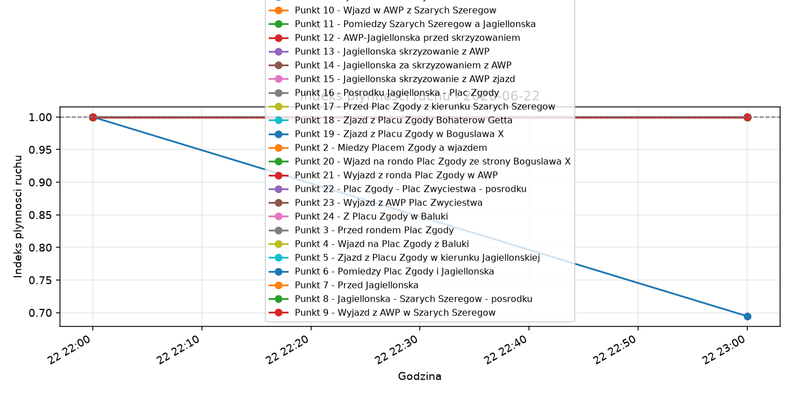
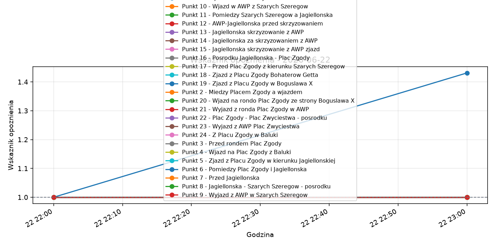

# Dobowy raport warunkow ruchu: 2026-06-22

Projekt: Monitoring warunkow ruchu na al. Wojska Polskiego w Szczecinie
Wygenerowano: 2026-06-23 08:01

## Podsumowanie

Liczba pomiarow: 48
Liczba punktow pomiarowych: 24
Liczba cykli pomiarowych: 48
Srednia predkosc biezaca: 37.02 km/h
Sredni indeks plynnosci ruchu: 0.99
Sredni wskaznik opoznienia: 1.01

## Najwazniejsze obserwacje

Srednia dobowa interpretacja warunkow: ruch plynny. Sredni indeks plynnosci wyniosl 0.99, a sredni wskaznik opoznienia 1.01. Najmniej korzystna godzina wystapila okolo 23:00, ze srednim indeksem plynnosci 0.99. Najbardziej obciazony punkt pomiarowy to Punkt 19 - Zjazd z Placu Zgody w Boguslawa X.

### Najgorsza godzina

- Godzina slotu pomiarowego: 2026-06-22 23:00
- Sredni indeks plynnosci: 0.99
- Sredni wskaznik opoznienia: 1.02
- Srednia predkosc: 36.79 km/h

### Najbardziej przeciazony punkt

- Punkt: Punkt 19 - Zjazd z Placu Zgody w Boguslawa X
- ID: awp_p19_zjazd_zgody_boguslawa
- Sredni indeks plynnosci: 0.85
- Sredni wskaznik opoznienia: 1.22

## Tabela punktow pomiarowych

| ID punktu | Punkt | Kierunek | Predkosc sr. | Predkosc min | Predkosc max | Indeks sr. | Indeks min | Indeks max | Opoznienie sr. | Opoznienie min | Opoznienie max | Sekundy opoznienia sr. | Wiarygodnosc sr. | Liczba pomiarow |
| --- | --- | --- | --- | --- | --- | --- | --- | --- | --- | --- | --- | --- | --- | --- |
| awp_p19_zjazd_zgody_boguslawa | Punkt 19 - Zjazd z Placu Zgody w Boguslawa X | Plac Zgody -> Boguslawa X | 30.50 | 25.00 | 36.00 | 0.85 | 0.69 | 1.00 | 1.22 | 1.00 | 1.43 | 12.50 | 0.99 | 2 |
| awp_p01_wjazd_od_placu_zwyciestwa | Punkt 1 - Wjazd od Placu Zwyciestwa | Plac Zwyciestwa -> Plac Zgody | 59.00 | 59.00 | 59.00 | 1.00 | 1.00 | 1.00 | 1.00 | 1.00 | 1.00 | 0.00 | 1.00 | 2 |
| awp_p02_miedzy_zgody_a_wjazdem | Punkt 2 - Miedzy Placem Zgody a wjazdem | Plac Zwyciestwa -> Plac Zgody | 32.00 | 32.00 | 32.00 | 1.00 | 1.00 | 1.00 | 1.00 | 1.00 | 1.00 | 0.00 | 1.00 | 2 |
| awp_p03_przed_rondem_plac_zgody | Punkt 3 - Przed rondem Plac Zgody | Plac Zwyciestwa -> Plac Zgody | 32.00 | 32.00 | 32.00 | 1.00 | 1.00 | 1.00 | 1.00 | 1.00 | 1.00 | 0.00 | 1.00 | 2 |
| awp_p04_wjazd_z_baluki | Punkt 4 - Wjazd na Plac Zgody z Baluki | Baluki -> Plac Zgody | 32.00 | 32.00 | 32.00 | 1.00 | 1.00 | 1.00 | 1.00 | 1.00 | 1.00 | 0.00 | 1.00 | 2 |
| awp_p05_zjazd_zgody_do_jagiellonskiej | Punkt 5 - Zjazd z Placu Zgody w kierunku Jagiellonskiej | Plac Zgody -> Jagiellonska | 32.00 | 32.00 | 32.00 | 1.00 | 1.00 | 1.00 | 1.00 | 1.00 | 1.00 | 0.00 | 1.00 | 2 |
| awp_p06_miedzy_zgody_jagiellonska | Punkt 6 - Pomiedzy Plac Zgody i Jagiellonska | Plac Zgody -> Jagiellonska | 40.00 | 40.00 | 40.00 | 1.00 | 1.00 | 1.00 | 1.00 | 1.00 | 1.00 | 0.00 | 1.00 | 2 |
| awp_p07_przed_jagiellonska | Punkt 7 - Przed Jagiellonska | Plac Zgody -> Jagiellonska | 40.00 | 40.00 | 40.00 | 1.00 | 1.00 | 1.00 | 1.00 | 1.00 | 1.00 | 0.00 | 1.00 | 2 |
| awp_p08_jagiellonska_szarych_posrodku | Punkt 8 - Jagiellonska - Szarych Szeregow - posrodku | Jagiellonska -> Plac Szarych Szeregow | 33.00 | 33.00 | 33.00 | 1.00 | 1.00 | 1.00 | 1.00 | 1.00 | 1.00 | 0.00 | 1.00 | 2 |
| awp_p09_wyjazd_awp_szarych_szeregow | Punkt 9 - Wyjazd z AWP w Szarych Szeregow | AWP -> Plac Szarych Szeregow | 36.00 | 36.00 | 36.00 | 1.00 | 1.00 | 1.00 | 1.00 | 1.00 | 1.00 | 0.00 | 1.00 | 2 |
| awp_p10_wjazd_awp_z_szarych_szeregow | Punkt 10 - Wjazd w AWP z Szarych Szeregow | Plac Szarych Szeregow -> AWP | 38.00 | 38.00 | 38.00 | 1.00 | 1.00 | 1.00 | 1.00 | 1.00 | 1.00 | 0.00 | 1.00 | 2 |
| awp_p11_miedzy_szarych_a_jagiellonska | Punkt 11 - Pomiedzy Szarych Szeregow a Jagiellonska | Plac Szarych Szeregow -> Jagiellonska | 40.00 | 40.00 | 40.00 | 1.00 | 1.00 | 1.00 | 1.00 | 1.00 | 1.00 | 0.00 | 1.00 | 2 |
| awp_p12_awp_jagiellonska_przed_skrzyzowaniem | Punkt 12 - AWP-Jagiellonska przed skrzyzowaniem | Plac Szarych Szeregow -> Jagiellonska | 40.00 | 40.00 | 40.00 | 1.00 | 1.00 | 1.00 | 1.00 | 1.00 | 1.00 | 0.00 | 1.00 | 2 |
| awp_p13_jagiellonska_skrzyzowanie_awp | Punkt 13 - Jagiellonska skrzyzowanie z AWP | skrzyzowanie Jagiellonska/AWP | 40.00 | 40.00 | 40.00 | 1.00 | 1.00 | 1.00 | 1.00 | 1.00 | 1.00 | 0.00 | 1.00 | 2 |
| awp_p14_jagiellonska_za_skrzyzowaniem | Punkt 14 - Jagiellonska za skrzyzowaniem z AWP | Jagiellonska za skrzyzowaniem | 33.00 | 33.00 | 33.00 | 1.00 | 1.00 | 1.00 | 1.00 | 1.00 | 1.00 | 0.00 | 1.00 | 2 |
| awp_p15_jagiellonska_zjazd | Punkt 15 - Jagiellonska skrzyzowanie z AWP zjazd | zjazd Jagiellonska/AWP | 40.00 | 40.00 | 40.00 | 1.00 | 1.00 | 1.00 | 1.00 | 1.00 | 1.00 | 0.00 | 1.00 | 2 |
| awp_p16_jagiellonska_plac_zgody_posrodku | Punkt 16 - Posrodku Jagiellonska - Plac Zgody | Jagiellonska -> Plac Zgody | 40.00 | 40.00 | 40.00 | 1.00 | 1.00 | 1.00 | 1.00 | 1.00 | 1.00 | 0.00 | 1.00 | 2 |
| awp_p17_przed_zgody_od_szarych | Punkt 17 - Przed Plac Zgody z kierunku Szarych Szeregow | Jagiellonska -> Plac Zgody | 32.00 | 32.00 | 32.00 | 1.00 | 1.00 | 1.00 | 1.00 | 1.00 | 1.00 | 0.00 | 1.00 | 2 |
| awp_p18_zjazd_zgody_boh_getta | Punkt 18 - Zjazd z Placu Zgody Bohaterow Getta | Plac Zgody -> Bohaterow Getta | 32.00 | 32.00 | 32.00 | 1.00 | 1.00 | 1.00 | 1.00 | 1.00 | 1.00 | 0.00 | 1.00 | 2 |
| awp_p20_wjazd_z_boguslawa | Punkt 20 - Wjazd na rondo Plac Zgody ze strony Boguslawa X | Boguslawa X -> Plac Zgody | 32.00 | 32.00 | 32.00 | 1.00 | 1.00 | 1.00 | 1.00 | 1.00 | 1.00 | 0.00 | 1.00 | 2 |
| awp_p21_wyjazd_zgody_w_awp | Punkt 21 - Wyjazd z ronda Plac Zgody w AWP | Plac Zgody -> Plac Zwyciestwa | 32.00 | 32.00 | 32.00 | 1.00 | 1.00 | 1.00 | 1.00 | 1.00 | 1.00 | 0.00 | 1.00 | 2 |
| awp_p22_zgody_zwyciestwa_posrodku | Punkt 22 - Plac Zgody - Plac Zwyciestwa - posrodku | Plac Zgody -> Plac Zwyciestwa | 32.00 | 32.00 | 32.00 | 1.00 | 1.00 | 1.00 | 1.00 | 1.00 | 1.00 | 0.00 | 1.00 | 2 |
| awp_p23_wyjazd_awp_plac_zwyciestwa | Punkt 23 - Wyjazd z AWP Plac Zwyciestwa | AWP -> Plac Zwyciestwa | 59.00 | 59.00 | 59.00 | 1.00 | 1.00 | 1.00 | 1.00 | 1.00 | 1.00 | 0.00 | 1.00 | 2 |
| awp_p24_z_placu_zgody_w_baluki | Punkt 24 - Z Placu Zgody w Baluki | Plac Zgody -> Baluki | 32.00 | 32.00 | 32.00 | 1.00 | 1.00 | 1.00 | 1.00 | 1.00 | 1.00 | 0.00 | 1.00 | 2 |

## Wykresy godzinowe

### Predkosc biezaca [km/h]

![Predkosc biezaca [km/h]](../figures/current_speed_2026-06-22.png)

### Indeks plynnosci ruchu

### Wskaznik opoznienia

## Uwagi metodologiczne

Raport opisuje warunki ruchu na podstawie predkosci, czasu przejazdu oraz wskaznikow opoznienia i przeciazenia. Nie jest to bezposredni pomiar natezenia ruchu w pojazdach na godzine.
